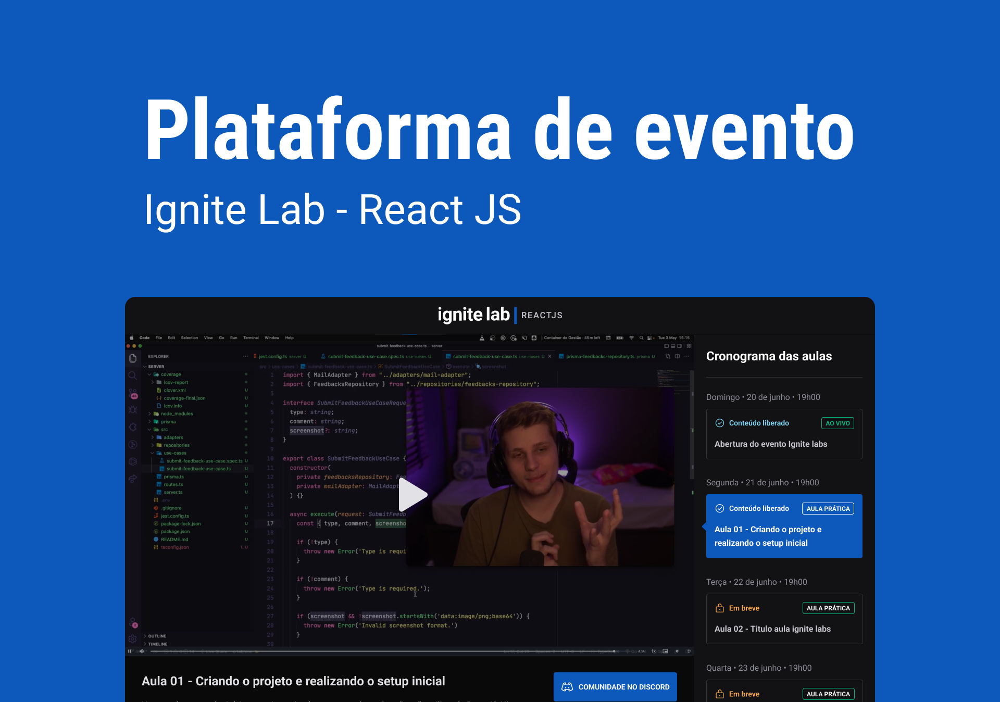

<p align="center">
  
</p>

<h4 align="center"><a href="https://event-platform-sampaiocode.vercel.app">Clique para visitar o projeto</a></h4>

---

## 💻 Sobre o projeto

Esse projeto trata-se de uma plataforma de evento para exibição de aulas, que foi desenvolvida durante o evento Ignite Lab - React JS. As aulas/vídeos são catalogadas no GraphCMS, depois consumidas por meio da API e exibidas após o usuário efutuar o cadastrado na plataforma.

## 🛠️ Tecnologias

Este projeto foi desenvolvido utilizando as seguintes tecnologias:

- [ReactJS](https://reactjs.org/)
- [TypeScript](https://www.typescriptlang.org/)
- [Tailwind CSS](https://tailwindcss.com/)
- [Vitejs](https://vitejs.dev/)
- [Vimejs](https://vimejs.com/)
- [GraphQL](https://graphql.org/)
- [GraphCMS](https://graphcms.com/)
- [Apollo](https://www.apollographql.com/)

## ✅ Novas funcionalidades

- [x] Responsividade
- [x] Autenticação em rotas
- [x] Página de Erro 404
- [x] Botão de Logout

## 🚀 Instalação

**Clone o projeto**

```bash
git clone https://github.com/sampaiocode/event-platform.git
```

**Siga os passos abaixo**

```bash
# Acesse a pasta
$ cd event-platform

# Instale as dependências
$ yarn

# Inicie a aplicação
$ yarn dev
```

## 💾 Variáveis ​​de ambiente

Para executar este projeto, você precisará adicionar as seguintes variáveis ​​de ambiente ao seu arquivo `.env`:

- **`VITE_APP_API_URL`:** Link da API do **GraphCMS**
- **`VITE_APP_API_TOKEN`:** Token **GraphCMS**

## 🔖 Layout

Você pode visualizar o layout do projeto através [desse link](https://www.figma.com/community/file/1120711251998877938). É necessário ter conta no [Figma](https://figma.com) para acessá-lo.

## 📝 Licença

Esse projeto está sob licença. Veja o arquivo [LICENÇA](LICENSE) para mais detalhes.

---

Desenvolvido com 💙 por [Deivit Eduardo](https://github.com/sampaiocode)
